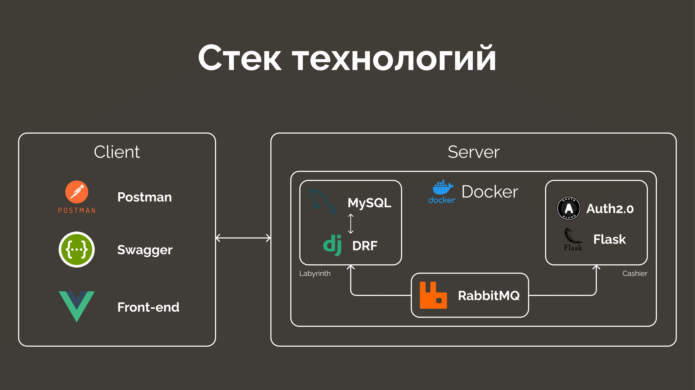

# Проект промо-сайта для "Дора Пицца"

## Описание
Мой друг считает, что для повышения охватов пиццерии ей нужна реклама, с чем он и попросил меня помочь. В голову пришла идея создать промо сайт с возможностью ответа на вопросы в виде лабиринта или дерева. 
Неизвестность - это то, что заинтересовывает людей. А проходя по веhному пути лабиринта пользователь может узнать немного больше о той самой пиццерии. Пользователям, правильно ответившим на финальный вопрос, в подарок даётся промокод и рассказывается история о том, где и как его можно применить. Стоит учесть, что из правильных ответов на вопросы складывается полная картина о том, кто смог создать сайт, который заинтриговал весь мир.

## Архитектура


## Необходимое для запуска

[Docker Desktop](https://www.docker.com/products/docker-desktop)

## Запуск системы с использованием образов

Чтобы запустить проект откройте файл [docker-compose.yml](docker-compose.yml?raw=true) с помощью консоли и напишите команды

1. Скачивание обравзов с docker hub

```cmd
docker-compose pull
```

2. Запуск сервисов

```cmd
docker-compose up -d
```
3. Если сервис не может подключиться к бд, то надо написать
```cmd
docker-compose exec mystery python manage.py migrate
```
4. Фикстуры вопросов, ответов и скидок можно загрузить следующими командами
```cmd
docker-compose exec mystery python manage.py loaddata question
docker-compose exec mystery python manage.py loaddata answers
docker-compose exec mystery python manage.py loaddata sale
```
После старта проекта api будут доступны на [localhost:8000](http://localhost:8000)
и [localhost:5000](http://localhost:5000)

